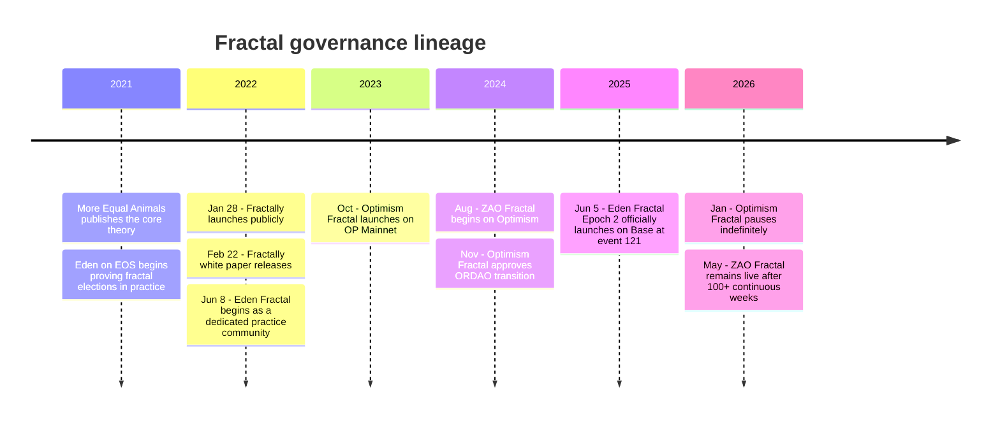
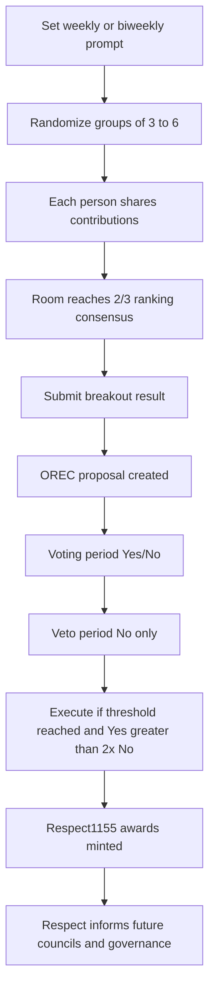

# 705 - Fractal Governance and the Respect Game Ecosystem (External Deep-Research Synthesis)

> **Goal:** Preserve an external ChatGPT deep-research report on fractal governance, commissioned 2026-05-21, as a library reference and an independent cross-check on the fractal campaign (docs 056-306, 702-704).

## Editor's note - provenance and how to read this

This document is an **external deep-research report produced by ChatGPT** on 2026-05-21, from the deep-research prompt built during the fractal campaign. It is captured here largely verbatim. ChatGPT's inline citation tokens have been stripped; em dashes converted to hyphens. The "Source URLs" section at the end is as ChatGPT reported it - those URLs were not independently re-verified by the ZAO research process.

ChatGPT read the `ws/research-fractal-campaign` branch docs directly (raw.githubusercontent URLs), so this report is partly a reflection of the campaign's own work. Treat it as a cross-check, not an independent corpus.

**Where it corroborates the campaign:** orclient at v1.4.4; respectgame.app not in active development; Optimism Fractal paused Jan 2026; Eden Fractal live on Base; the two-thirds consensus rule; the OG/ZOR ledger reconciliation problem.

**Where it adds something new:**
- The Fractally white paper's *original* round-one payout curve was **21/13/8/5/3/2** (cumulative multi-round), distinct from the modern single-round 55/34/21/13/8/5. Worth folding into docs 058/698.
- A genuine philosophical tension: the Fractally white paper *critiqued* optimistic governance (Aragon-style), yet ORDAO's OREC *embraces* an optimistic executive model. The public record has no essay bridging that shift.
- The ORDAO repo (`sim31/ordao`) was at ~266 commits when inspected.
- Eden+Fractal uses roughly two-month delegate terms.
- Rank-label inconsistency across sources (top contribution called "Level 6" in some Eden materials, "rank 1" in ZAO shorthand) - public explainers should standardize on "highest-to-lowest payout order".

**Caveats it raises:** the wider community directory (Roy Fractal, Fractal Hispano, etc.) has uneven documentation - consistent with doc 104's own hedging.

---

## Executive summary

Fractal governance is best understood as a family of coordination systems built around one deceptively simple idea: small groups can make better judgments than large crowds, and those judgments can scale if they are nested fractally. In this lineage, Daniel Larimer's *More Equal Animals* supplied the core critique of mass voting and "rational ignorance"; Fractally translated that critique into a protocol and a token concept; Eden Fractal turned it into a long-running practice community; Optimism Fractal ported it into Ethereum/Superchain public-goods governance; and ZAO Fractal adapted it into a music-centered implementation on Optimism. As of May 2026, the high-confidence live centers of gravity are Eden Fractal and ZAO Fractal; Optimism Fractal is paused, and Fractally itself is dormant as a product/community, though still foundational as a theory source.

The Respect Game is the recurring engine that makes the ecosystem go. Participants meet in randomized groups of roughly three to six, share recent contributions, and reach a two-thirds consensus on relative ranking. The official Eden/Optimystics explanations describe payout as a Fibonacci-like curve in which each tier earns roughly 60 percent more than the one below; contemporary Eden-style implementations commonly describe payouts running from 55 to 5 for a six-person room, while the original Fractally white paper used an earlier cumulative multi-round framing beginning at 21 to 2 in round one. ZAO then doubled the Eden-style pattern into 110/68/42/26/16/10. The common invariant is not the exact numbers; it is that governance weight is earned by peer-recognized contribution, not bought with capital.

On the tooling side, the most mature layer is the Optimystics / ORDAO stack: OREC for optimistic execution, Respect1155 for non-transferable reputation awards, orclient for application integration, ornode for off-chain proposal and metadata indexing, and frapps/orfrapps for deployment. Those components are real software, not vaporware: the upstream `sim31/ordao` repository is active, the ORDAO README documents live deployments including Eden and ZAO, and the npm package `@ordao/orclient` was available at v1.4.4 in 2026. The maturity is uneven, though. Contracts, architecture, and SDKs look substantially more mature than the async frontends; `respect.games-ui`, for example, reads more like an unfinished shell than a fully documented production product.

On the synchronous versus asynchronous question, the ecosystem's public record points to a clear practical answer: synchronous play is the proven default; asynchronous coordination is promising but still under-proven in this lineage. Fractalgram and the classic breakout-room format are battle-tested. Respect.Games exists as an async-oriented app and the ORfrapps process itself uses a Synchronous Respect Tree for prioritization, but ZAO's May 2026 research explicitly treats `respectgame.app` as not in active development and frames async as exploratory rather than the default operating model. Fractal Circles is a nearby, independently evolving project that is highly relevant for hybrid patterns, but it is not the same thing as the ORDAO/Respect Game stack.

For an adoption-minded community, the bottom line is straightforward: start with a lightweight synchronous pilot, keep the scoring simple, document everything, then integrate ORDAO only after the social process is stable. For a book project or a music collective, run four to eight cycles off-chain first; move to ORDAO only when attendance, prompts, facilitation, and ranking norms are dependable; then layer in a delegate or council process; and only after that experiment with async pre-work, contribution requests, or evidence boards. The social process is the product. The smart contracts are the seatbelts.

## Origins and philosophy

Fractal governance emerged as a response to a familiar democratic failure mode: the larger the group, the less informed and less meaningful ordinary voting becomes. The Fractally white paper states the problem bluntly under the heading of rational ignorance: in ordinary voting systems, the expected value of one vote is tiny, while the cost of becoming well informed is high, so most people rationally remain under-informed. Its answer was to replace abstract mass voting with randomly assigned, human-scale deliberation in groups of roughly six, where participants directly compare visible contributions and must reach consensus or nobody in that room earns anything.

Eden Fractal's public educational material carries this same philosophical frame forward in a friendlier tone. Its articles on fractal decision-making and fractal democracy describe these systems as nested small groups that preserve human connection while scaling coordination, emphasizing local knowledge, peer evaluation, nested consensus, and resistance to capture by wealth or media power. Optimism Fractal's council materials then restate the same claim in Superchain language: large systems need a reputation layer built from small-group evaluation if they want to remain democratic while still getting things done.

The lineage is not just ideological; it is also architectural. Fractally's original ambition was broad: it was pitched not only as a governance method but as a full-stack next-generation DAO platform combining a decentralized exchange, social media, and a high-performance smart-contract layer with fractal governance. The Fractally website still describes that bigger dream and explicitly frames public-goods production - music, art, science, journalism, open source - as a key target. The January 2022 launch post on Medium repeats the same broad vision.

That matters because the later Eden/Optimystics ecosystem is both a continuation and a narrowing of scope. The live communities did NOT carry forward the whole Fractally "DEX + social network + governance stack" package. Instead, they preserved and refined the pieces that proved socially durable: the Respect Game, soulbound/non-transferable reputation, council formation, agenda games, and on-chain execution for selected decisions. In other words, the ecosystem matured by becoming more modular and less grandiose. That is usually how reality wins arguments with white papers.

There is also a genuinely important philosophical evolution - almost a contradiction - in the public record. The Fractally white paper critiqued Aragon-style optimistic governance as something that could hide off-chain decision-making and create spam or challenge burdens. Yet ORDAO's OREC later embraces an optimistic executive model with a veto period. There is no public essay that fully narrates this shift, but the best reading is that the ecosystem changed its position after years of practice: optimism became acceptable when the community already had a strong off-chain consensus process and when the optimistic contract was explicitly designed as an execution layer with anti-spam limits and a veto window. That is not hypocrisy so much as a refinement of scope - but the documentation should say this more clearly than it currently does.

## History and community landscape

The simplest accurate timeline looks like this:



That sequence is supported by Fractally's launch post, the Fractally white paper, Eden Fractal's Epoch 1 and Epoch 2 historical articles, Optimism Fractal's current homepage and council pages, and ZAO's 2026 consolidation docs. One nuance matters: Eden's homepage says "since 2021," while the Epoch 2 article says Eden Fractal itself began in June 2022. That is a distinction between the broader Eden-on-EOS roots from 2021 and Eden Fractal proper from 2022.

### Core communities and projects

| Project | What it is | Current status | Why it matters |
|---|---|---|---|
| **Fractally** | The original protocol-and-platform vision around fractal democracy, Respect, and public-goods funding | Dormant as a live community/product, though the website and white paper remain available | It supplied the core theory and early protocol design |
| **Eden Fractal** | The longest-running practical R&D community for fractal governance | Active on Base, with biweekly events and Epoch 2 live | It is the ecosystem's main laboratory and reference implementation |
| **Optimism Fractal** | The Optimism/Superchain adaptation that pioneered the Ethereum L2 public-goods use case | Paused indefinitely as of January 2026 | It proved the model on OP Mainnet and incubated ORDAO in production |
| **ZAO Fractal** | The music-focused adaptation on Optimism | Active and continuous in May 2026 | It is the clearest example of domain-specific adaptation, especially for creative communities |
| **Respect.Games / respectgame.app** | Async-oriented Respect Game application | Experimental / dormant in practice | It represents the async branch, but not the proven core |
| **Fractal Circles** | A related but separate fractal-circles collaboration project centered on teams of six and representatives | Active as an adjacent initiative | It is relevant for hybrid patterns and async preparation, but it is not an ORDAO fractal community |

Fractally's site still describes the product and team, and the gofractally Medium publication shows no new publication after 2022; Eden's site advertises active biweekly events and a live Epoch 2 on Base; Optimism Fractal's homepage states that the council approved an indefinite pause and points people to Eden; ZAO's 2026 docs confirm ongoing weekly operation on Mondays at 6 p.m. Eastern; Respect.Games is described in frapps documentation as testing-phase async infrastructure, while ZAO's May 2026 research says it is not in active development; and Fractal Circles' website advertises an active bot/manual and a circles-of-six representative structure.

### Reported wider ecosystem

ZAO's 2026 research names additional communities as active, paused, concluded, or emerging: Roy Fractal, Fractal Hispano, Alien Worlds Fractal, Aquadac, EOS Respect, ZEOS Fractal, Eden Korea, Upland Fractal, Upscale Fractal, ThiagoRe, dNews, Supercivilization, and Dynamics of Hegemony. Not all of those are equally verified - the public record is much stronger for Eden, Optimism, ZAO, Fractally, and Fractal Circles than for the long tail. The ecosystem is bigger than the main Superchain line, but its documentation quality is highly uneven.

## Mechanics of the Respect Game

At the gameplay level, the Respect Game is simple enough to explain to a newcomer in one minute. A community sets a prompt tied to a shared mission. Participants are randomly sorted into groups of roughly three to six. Each participant gets a short window - typically up to about four minutes - to explain what they contributed since the last session. The room discusses and settles on a ranking by two-thirds consensus. The resulting order is recorded, and participants receive Respect, a non-transferable reputation token, according to a Fibonacci-style payout curve.

A subtle but important documentation problem is that rank notation is inconsistent across sources. Some Eden materials describe the top contribution as Level 6 and the lowest as Level 1. ZAO's shorthand usually says the room ranks people 1-6 with 1 as highest. The safest way to describe the system is therefore not "rank 1" or "rank 6," but rather highest-to-lowest payout order. The payout order is stable even when the labels wobble.

### Scoring curves in practice

| Curve family | Highest-to-lowest six-person payout | Where it appears | What it implies |
|---|---|---|---|
| **Original Fractally round-one curve** | 21 / 13 / 8 / 5 / 3 / 2 | Fractally white paper | Designed for multi-round cumulative ranking across a larger fractal |
| **Canonical later single-round curve** | 55 / 34 / 21 / 13 / 8 / 5 | Eden / Optimism educational materials | A recognizable "modern default" in the live ecosystem |
| **ZAO 2x curve** | 110 / 68 / 42 / 26 / 16 / 10 | ZAO Fractal | More differentiation, especially for top contributions |

The Fractally white paper presents a cumulative/multi-round Fibonacci ladder beginning with 21 as the top first-round payout; Eden's current Respect Game pages describe the later six-person single-round framing as 55 down to 5; and ZAO's governance docs explicitly document the doubled curve.

In practical terms, the Fibonacci family does three things at once. First, it creates real differentiation without heading into winner-take-all territory. Second, it is robust to human judgment error: if people are directionally right but not perfectly precise, the step sizes are large enough to preserve signal. Third, it makes "gaming" harder because the scarce thing is not money but peer agreement in a random room. You can lobby. You cannot buy your way to being widely respected if the room thinks your contribution was thin.

### Scaling beyond one room

The "fractal" part appears when a community gets too large for one layer of rooms. The original Fractally design sends the top-ranked participant from each first-round room into a second round, then repeats as needed. The white paper includes attendance estimates showing that most people only need to attend one hour, while a shrinking top slice stays for additional rounds. In current practice, however, single-round usage appears dominant in the communities reviewed, especially where attendance remains moderate.

### Respect as a token

Respect in the current ORDAO ecosystem is not a tradable governance coin. In Eden/Optimystics materials it is a soulbound token; in ORDAO it is implemented as Respect1155, where awards are non-transferable ERC-1155 tokens whose denominations sum into a fungible-looking Respect balance. The ORDAO contract documentation explicitly says transfer and approval operations revert, and OREC assumes voting power comes from a non-transferable Respect source. This is the core reason the ecosystem can credibly say that governance weight follows contribution history, not capital accumulation.

### Decay

Decay is one of the most misunderstood parts of the public record. There is no evidence that decay is built into the current core ORDAO contracts. Respect1155 stores denominations and balances, but its public documentation does not describe automatic balance decay. By contrast, ZAO's research recommends an effective 2 percent weekly decay with a roughly 34-week half-life for UI tiers and governance interpretation. So the accurate statement is: decay exists as a community policy option, not as a universal protocol rule.

For a new community, treat decay as an explicit design choice:

| Decay option | Best for | Upside | Downside | Recommendation |
|---|---|---|---|---|
| **No decay** | Early pilots, founder-stage communities | Easiest to explain; least controversial | Early contributors can ossify power | Good for weeks 1-8 |
| **Light effective decay** | Communities with steady recurring work | Rewards continued participation while preserving memory | Adds complexity to dashboards and rules | Default: 2% weekly effective decay off-chain/UI |
| **Seasonal reset or partial reset** | Cohort-based programs, residencies, festivals | Clean cycles and fresh leadership | Can erase hard-won trust too aggressively | Better for event-based collectives than long-lived guilds |

The only sourced number in that table is the 2 percent weekly ZAO recommendation; the rest is implementation advice based on the ecosystem's current gaps.

### From discussion to on-chain execution



That flow is the intersection of the official Respect Game description, the OREC specification, ORDAO's architecture docs, and ZAO's implementation notes.

## Tooling and maturity

The ORDAO stack is now the ecosystem's real technical backbone. The upstream `sim31/ordao` repository describes ORDAO as a toolset for DAOs using non-transferable Respect, with smart contracts, client library, backend service, and frontend. Its architecture is clear and modular: OREC for optimistic execution, Respect1155 for soulbound awards, orclient for application-facing integration, ornode for off-chain proposal and metadata availability, and a GUI layer that can be swapped out. The repo page shows a real working codebase rather than a conceptual stub, with 266 commits at the time it was inspected.

### Tooling maturity snapshot

| Component | Function | Maturity | Evidence and caveats |
|---|---|---|---|
| **OREC** | Optimistic on-chain execution of community-approved actions | Production-capable | Spec is clear, parameterized, already used in live communities; assumes off-chain consensus and protects with a veto phase and anti-spam cap |
| **Respect1155** | Non-transferable ERC-1155 awards whose values sum to Respect balances | Production-capable | Contract docs concrete and coherent; transfer and approval revert because the token is soulbound |
| **orclient** | SDK for reads, proposal creation, votes, execution, ORNode integration | Production-capable | Official README detailed; npm showed `@ordao/orclient` at v1.4.4 in 2026 |
| **ornode** | API/indexer for proposals, votes, awards, token metadata | Operational but infrastructure-sensitive | README is good, but ZAO docs show a real case where an ornode endpoint went down while direct contract reads still worked |
| **frapps / orfrapps** | Deployment/configuration layer for community instances | Useful and fairly mature | The newer `orfrapps` repo documents `frapp.json`, CLI workflows, nginx/Mongo requirements, deployment requests |
| **Fractalgram** | Live-event interface for synchronous coordination | Practically important, documentation uneven | Official materials describe it as the live-event frontend, but the repo/documentation surface is thinner than ORDAO proper |
| **Respect.Games / respect.games-ui** | Async-oriented gameplay frontend | Beta / exploratory | frapps docs describe it as testing-phase async infrastructure, but the public README is generic boilerplate and ZAO research says it should not be treated as actively developed in May 2026 |
| **ZAO app instance** | ZAO-specific ORDAO deployment | Live deployment, community-specific UX | ORDAO docs list `zao.frapps.xyz` as a live instance; ZAO docs describe it as live, though the public app shell is JS-heavy and hard to inspect statically |

The most important architectural fact is the on-chain/off-chain split. ORDAO intentionally stores only proposal hashes on-chain; full proposal content and metadata live in ornode; and orclient hides that split from apps. This keeps contracts small and composable, but it means production reliability depends on both blockchain infrastructure and a maintained indexing/API layer. That trade-off is good engineering, but communities should not pretend it is "purely on-chain." It is not.

The second major maturity judgment is that the contracts are ahead of the social productization. ORDAO, OREC, and Respect1155 are well enough specified that a serious team can build with them now. The public docs and UX around async participation, contributor onboarding, and long-tail community operations are less mature. ZAO's own internal assessment says documentation is the main bottleneck for onboarding non-technical contributors, and that diagnosis is correct. The software stack exists; the "explain it to a normal human" layer still needs work.

## Synchronous, asynchronous, and hybrid patterns

The ecosystem's proven operating system is still the synchronous session. That is not nostalgia; it follows directly from the design. Fractally's white paper says all groups in a round should meet simultaneously partly to reduce multi-account abuse and preserve the integrity of random assignment. The official Respect Game rules are built around short live speeches, room discussion, and consensus. OREC also assumes that a community has already used some off-chain tools to build consensus and that the contract is mainly executing the result. The canonical stack is: live deliberation first, chain execution second.

Synchronous play has four decisive advantages. First, it maximizes local knowledge: room members can ask follow-up questions and detect bluffing or vagueness. Second, it builds social trust and repeat familiarity, which is the actual substrate of peer evaluation. Third, it reduces operational ambiguity because there is one clear cadence and one shared moment of truth. Fourth, it aligns with OREC's design, which expects the chain vote to be a confirmation/challenge step, not the whole deliberation process.

Asynchronous participation is not nonsense; it is just less proved. The ecosystem has been trying to push in that direction. The frapps repository describes Respect.Games as a full-featured application for asynchronous gameplay with integrated on-chain coordination, and the older ORfrapps repository routes deployment requests through a Synchronous Respect Tree process tied to Eden's prioritization. ZAO's May 2026 notes also discuss GitHub-native async fractal ideas and interest in Fractal Circles as a way to prepare contributions before live ranking. The impulse toward async is real. It just has not yet produced a single obviously dominant async standard.

The strongest counter-evidence to "async is solved" is status evidence. ZAO's tooling doc says plainly that `respectgame.app` should not be the basis for new development because it was not in active development as of May 2026. The public `respect.games-ui` repository does not read like a polished production-ready community operating system. If someone says the async branch is already fully mature, the evidence does not support it.

Where the ecosystem has a compelling future is hybrid design. Three hybrid patterns already make sense from the public record:

### Async preparation, sync ranking

The most conservative and most practical pattern. Participants submit links, commits, drafts, recordings, issues, PRs, or contribution notes before the live session. The live session still does the actual peer comparison and final ranking. This preserves the human-quality advantages of sync while making attendance easier and evidence richer. It is also the pattern most compatible with a book project where contributors may be spread across time zones.

### Sync Respect Game, async legislative process

Eden's Eden+Fractal model already points in this direction. The Respect Game functions as the "judicial" or evaluation layer, while delegates then participate in a town-hall or proposal process over a fixed term. The earned-reputation layer remains grounded in live peer recognition while much of the actual proposal drafting, discussion, and revision happens asynchronously.

### Async contribution requests, sync or optimistic execution

The ORfrapps deployment process is revealing here. It tells users to make a deployment request by filing configuration artifacts and then creating a contribution request in an SRT game for prioritization. That is a real hybrid governance pattern in which durable artifacts exist asynchronously and reputation-weighted coordination then determines priority.

The trade-off in one line: sync is better at judgment; async is better at logistics. The communities that thrive will be the ones that compose them intelligently rather than replacing one with the other.

## Adoption blueprint

Four stages: minimum viable pilot, ORDAO integration, governance expansion, and async experiments. The social rituals come first; the contracts come second.

### Minimum viable pilot

For the first four to eight cycles, run off-chain only. No token launch, no treasury theatrics, no "revolutionary governance protocol" branding on day one. Just a recurring session, a prompt, randomized rooms, rankings, and a transparent scoreboard. The goal of this phase is to discover whether the community can actually recognize value together.

Default pilot settings:

| Setting | Recommended default | Why |
|---|---|---|
| Cadence | Weekly for a builder guild or music collective; biweekly for a research or book project | Weekly builds rhythm; biweekly is kinder to volunteers |
| Room size | 4-6, targeting 6 where possible | Matches the strongest design lineage and consensus math |
| Contribution share time | 3-4 minutes | Matches both official game explanations and real meeting ergonomics |
| Consensus rule | 2/3 agreement | Core invariant across the lineage |
| Scoring curve | 55/34/21/13/8/5 unless the community has a reason to differentiate harder | Easier to explain than ZAO's 2x curve |
| Recordkeeping | Spreadsheet or lightweight database | Faster than premature chain integration |

A practical 60-minute pilot agenda:

| Segment | Time | What happens |
|---|---|---|
| Welcome and prompt | 5 min | Restate mission, rules, and prompt |
| Breakout round | 35-40 min | Share contributions and discuss rankings |
| Finalize consensus | 10 min | Confirm ordering and objections |
| Whole-group close | 5-10 min | Read back rankings, collect process feedback |

For a book project, a prompt like: "What did I ship this week that materially advanced the manuscript, contributor network, research base, editing pipeline, or publication plan?"

For a music collective: "What did I create, curate, organize, or unblock this week that materially improved the collective's music, audience, collaborations, or infrastructure?"

Minimum data to record from day one: session date / period number, prompt text, participant IDs, randomized room assignment, final ranking order, consensus threshold reached, notes / evidence links, facilitator / submitter, any objections or abstentions.

### ORDAO integration

Once the community has survived several cycles and the rankings feel socially legitimate, move to ORDAO. The main decision is what Respect contract and governance path to use, not whether the social process works. ORDAO assumes consensus is built off-chain and then executed securely on-chain with low turnout pressure, a veto window, and anti-spam limits. The `orfrapps` tooling gives a documented path through `frapp.json`, deployment guides, nginx/static GUI hosting, and ornode configuration.

Practical ORDAO defaults:

| Parameter | Suggested default | Basis |
|---|---|---|
| Voting period | 48 hours | Common OREC examples and ZAO usage |
| Veto period | 48 hours | Same |
| Minimum yes-weight threshold | 5-10% of total Respect | OREC is designed for low-turnout execution; ZAO docs use 10% as a typical framing |
| Max live yes votes per account | 10 | Matches documented anti-spam pattern |
| Respect token standard | Respect1155 | Best-aligned with current ecosystem practice |
| SDK | `@ordao/orclient` | Best-documented integration path |

Make one structural choice early: who is allowed to submit breakout results on-chain. ZAO's own experience shows the risk of over-centralizing submission. Start with three to five trained submitters in the first on-chain phase, then broaden access once the UI and norms are stable.

### Governance expansion

After ORDAO is stable, add the second layer: delegation, councils, and proposal handling. The right model is a separation of roles: the Respect Game recognizes contributors; a delegate/council layer bundles that recognition into decision capacity for a limited term; OREC executes what the community has already shaped.

For a book project, form a small rotating council for editorial disputes, budget decisions, release sequencing, attribution policy, and partnerships. For a music collective, form one for playlist or release curation, event lineups, grants or splits, technical infrastructure priorities, and community health. Start with one- or two-month delegate terms - Eden+Fractal documents roughly two-month delegate periods, long enough to matter but short enough to avoid fiefdoms.

### Async experiments

Only after the sync core and on-chain pipeline are stable, introduce async experiments, in this order:

| Async layer | What to test first | Why |
|---|---|---|
| Evidence board | Shared links, drafts, stems, commits, proposals posted before session | Low-risk and high-value |
| Contribution requests | People can ask for recognition on specific items between sessions | Good for transparency and quieter members |
| Topic and proposal queue | Async drafting before council consideration | Already consonant with Eden/Telegram style |
| Full async ranking | Very limited pilots only | Still under-proven in this ecosystem |

Do not jump straight to fully async ranking for a music collective - music depends on live context, playback, vibe, follow-up questions, and communal calibration. For a book project, async evidence and even async pre-ranking are more viable, but keep a live final sorting moment unless attendance logistics make that impossible.

## Open questions and limitations

First, there is no clean public narrative explaining how the ecosystem moved from Fractally's critique of optimistic governance to ORDAO's explicitly optimistic executive contract.

Second, the public docs are inconsistent about rank labels - whether the highest contribution is called rank 1 or level 6. Public-facing explainers should standardize on "highest-to-lowest payout order."

Third, decay is not standardized. Some ZAO materials recommend 2 percent weekly effective decay, but the core ORDAO contracts do not implement universal automatic decay. Communities need to state plainly whether they mean raw on-chain balance, decayed effective score, tier score, or voting score.

Fourth, ZAO's current architecture still reflects an unresolved migration problem: its research repeatedly notes the coexistence of an older OG Respect ERC-20 ledger and a newer ZOR ERC-1155 / OREC era, with reconciliation still a live issue. Reputation migrations are governance events, not just database chores.

Fifth, the broader ecosystem directory beyond the core lineage is harder to verify than one would like. There is credible internal documentation for many named communities, but not a uniform public evidence trail. Confidence is high for the main line - Fractally, Eden, Optimism Fractal, ZAO, Respect.Games, Fractal Circles - and more cautious for the long tail.

Finally, some live apps - especially `zao.frapps.xyz` and `respectgame.app` - are public but not easily inspectable via static rendering, which means the external public record remains skewed toward GitHub docs, educational sites, and internal research notes rather than crisp product documentation.

## Also See

- [Doc 702](../702-respect-fractal-lineage/) - the campaign's own lineage synthesis
- [Doc 703](../703-zao-fractal-current-state-may-2026/) - ZAO Fractal current state
- [Doc 704](../704-eden-creators-media-ecosystem/) - Eden Creators media ecosystem
- [Doc 109](../109-optimystics-tooling-ecosystem/) - Optimystics tooling (the orclient v1.4.4 + respectgame.app status this report corroborates)
- [Doc 058](../058-respect-deep-dive/) - Respect token deep dive (candidate for the Fractally round-one curve note)

## Next Actions

| Action | Owner | Type | By When |
|--------|-------|------|---------|
| Fold the Fractally round-one curve (21/13/8/5/3/2) into docs 058 / 698 on next revision | Research | Doc update | Next re-validation |
| Add the "optimistic governance" philosophical tension (Fractally critique vs OREC) to doc 702 | Research | Doc update | Next re-validation |
| Standardize rank-label language to "highest-to-lowest payout order" across fractal docs | Research | Doc update | Next re-validation |
| Use the adoption blueprint here as the Respect Game starter guide for Tanja's book project | Zaal | Reference | When Tanja is ready |

## Sources

Captured as ChatGPT reported them; not independently re-verified by the ZAO research process.

### ZAO research docs (read from the ws/research-fractal-campaign branch)

```text
research/governance/056-ordao-respect-system
research/governance/058-respect-deep-dive
research/governance/103-fractal-governance-ecosystem
research/governance/104-fractal-communities-directory
research/governance/109-optimystics-tooling-ecosystem
research/governance/114-zao-fractal-live-infrastructure
research/governance/115-zao-data-reconciliation
research/governance/184-superchain-ordao-crosschain-fractal
research/governance/188-zao-fractal-bot-process
research/governance/285-ordao-orfrapps-updated-docs
research/governance/306-eden-fractal-op-fractal-deep-history
research/governance/450-pre-fractal-discord-talking-points-apr20
research/governance/497-sociocracy-circles-small-teams
research/governance/498-zao-fractal-adapted-for-zaostock
research/governance/502-zaostock-circles-v1-spec
research/governance/664-farcaster-fip-pow-tokenization-and-async-github-fractal
research/governance/702-respect-fractal-lineage
research/governance/703-zao-fractal-current-state-may-2026
research/community/105-fractal-key-people
research/community/106-dan-singjoy-eden-fractal-deep-dive
research/events/675-tanja-fractal-book-call-may18
```

### Official ecosystem websites and articles

```text
https://edenfractal.com/  (+ /blog, /vision, /mission, /fractal-decision-making-processes,
  /epoch1, /epoch2, /prosocial-games, /respectgame, /respect, /fractal-democracy,
  /why-fractal-democracy-is-necessary, /fractal-apps, /plus, and blog posts)
https://optimismfractal.com/  (+ /council)
https://optimystics.io/
https://fractally.com/  (+ Fractally White Paper 1.0 PDF)
https://medium.com/gofractally/introducing-fractally-the-next-generation-of-daos-7c94981514d8
https://medium.com/gofractally/bringing-off-chain-governance-on-chain-2f2586cfa5c4
```

### Technical repositories and package documentation

```text
https://github.com/sim31/ordao  (README, docs/OREC.md, orclient, ornode, respect1155, orec, package.json)
https://www.npmjs.com/package/@ordao/orclient
https://github.com/Optimystics  (frapps, respect.games-ui)
https://github.com/sim31/orfrapps
```

### Live app surfaces and adjacent projects

```text
https://respectgame.app
https://zao.frapps.xyz
https://fractalcircles.org/
```
